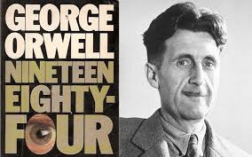
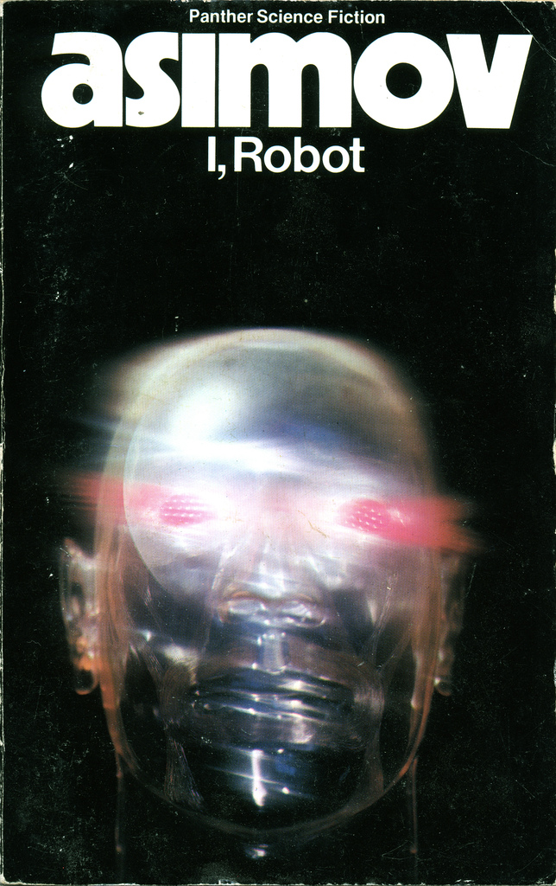

\newpage

\

# I'd like to tell you about some of my favourite books

- Still, I'm curious to know how many people here have read
(or even heard of) them

- in the past, people used to read "books", a now-forgotten
legacy media format, rendered obsolete by the massively multiplayer
misinfotainstreaming platforms we know and love

- in the future, the world will be divided into four parts

- I know this because of three books I've read and re-read so often
that I almost know them by heart.

- They all predict the same thing: a future world dominated by four players

# So let me tell you about these books and the four-way futures they predict:

- Two are classic SF novels - one upbeat, one alarming and depressing

- The third, a recent (and amusingly sardonic) business book.

\newpage

# Not everybody likes SF... 

but it's our shining window into the future.

SF can inspire and amaze by showing us possible worlds  
that warm the heart and touch the imagination. 

\

The first book I want to tell you about is not an example of this.

\newpage

# Brilliant, iconic dystopia novel 

"Nineteen eighty-four" by George Orwell (1948)

\

Actually, has anybody here even heard of it?

Orwell fought in the Spanish Civil War. There was much in-fighting on his side, and
Orwell's faction was (unfairly) discredited and suppressed by its own allies. 
He also worked in the BBC's  Ministry of Information during WW2. 
So he knew all about government propaganda.

\newpage

# The first book to describe a truly awful, but plausible future 

Today dystopia is a cliche - novels, and especially movies about the world 
going to s**t have become yet another wearisome multiplex genre. 
But "1984" was (I'd argue) the founding masterwork

- it's a straight extrapolation of the trends of the
first half of the 20th century. That is...

- ...the rapid and terrifying spread of political repression

- In "1984" democracy, truth and freedom are gone - the world is ruled by a small number 
of impregnable and despotic super-states, from which there can be no escape

- Happy ending: In our world (as of 2018) things didn't work out that way and we 
can now only dimly imagine how that was ever on the cards

\newpage

# "1984" is still remembered for its vivid and surreal images of hate propaganda... 

...a warped world of swiftly advancing media-savvy authoritarianism where the 
notion of "objective truth" has been lost

\

It's OK, we know this will never happen. Next book.

\newpage

# A much brighter future vision 

Written only 2 years later!

"I, Robot" by Isaac Asimov (1950)

\

Has anyone read this?

How about the Three Laws of Robotics? Do those ring a bell?

(Did I mention I have memorized all of these books by heart?)

Asimov was a professor of biochemistry who went on to write at least 60
books on popular science.
 
This book carries an amazing resonance, even today.

It's a series of stories describing rapid progress in robotics 1992-2050

In the first chapter, the robots are domestic toys, not even voice-enabled

In the last chapter they dominate everything: four superintelligent "Machines" 
control the world's economy and government.

Only they can see the future, and they are taking us with them.

\newpage

# Again, from where we are today, this is just too hard to believe... 

\

...which brings us to the next book

\newpage

# A new book, but (for me) an instant favourite  

"The Big Four" by Scott Galloway (2018)

{#id .class width=1000 height=400px}\

This is a New York Times bestseller - which is ironic because:

Galloway is a former NYT board member. He describes advising the company 
on how to fend off the threat from Google/Facebook (they didn't listen)

He's a former Morgan Stanley analyst who also founded a bunch of companies 
including L2, a business intelligence group which is now part of Gartner. 
So he does know about business analysis. 

\newpage

# Edited highlights

As business books go, this one stands out as being funny, shocking and insightful -
also very relevant and topical. 

I'll just share a few choice bits from it, and then wind up.

# Bubbling under

IMHO, the best chapter is about the 'runners up' - companies which could
conceivably compete with the "big four". These include Uber, Alibaba, Airbnb,
Tesla and some other interesting cases. But to concentrate on the main players:

# Facebook

Prediction: Oculus Rift is just a headfake to induce their competitors to
lose money. It will be closed down inside 2 years.

# Apple

They are a luxury brand, like Louis Vuitton. The Apple Stores are temples of quality.
But now that they're selling iPhones on Amazon, the advantage has been lost. This is
peak Apple.

# Google

The true successor to Microsoft, but it's a one trick pony and has not
found a profitable business outside of advertising. This makes it vulnerable to Amazon.

\newpage

# Amazon

Institutionally disruptive. Can borrow more patient capital than anyone else, 
cross-subsidise businesses where it has no intention of making money, and generally
"go deeper with a bigger oxygen tank". There is a stronger sense of grand strategy
than with the others, a sense of doing something never tried before. Phrases like
"apex predator" seem appropriate.

His admiration of Amazon is also tempered with calls for the company to be broken up.

Prediction: They will spin out AWS as a separate company, thereby getting ahead of any
trustbusting action. It will be one of the most successful IPOs ever, because
this is the only way for investors to place direct bets on cloud computing.

Galloway also comments that they're rapidly moving in on the other three. He says:

"Amazon has all the momentum... My next book will be called The Big One."

{#id .class width=800 height=350px}\

# THANK YOU