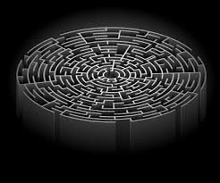
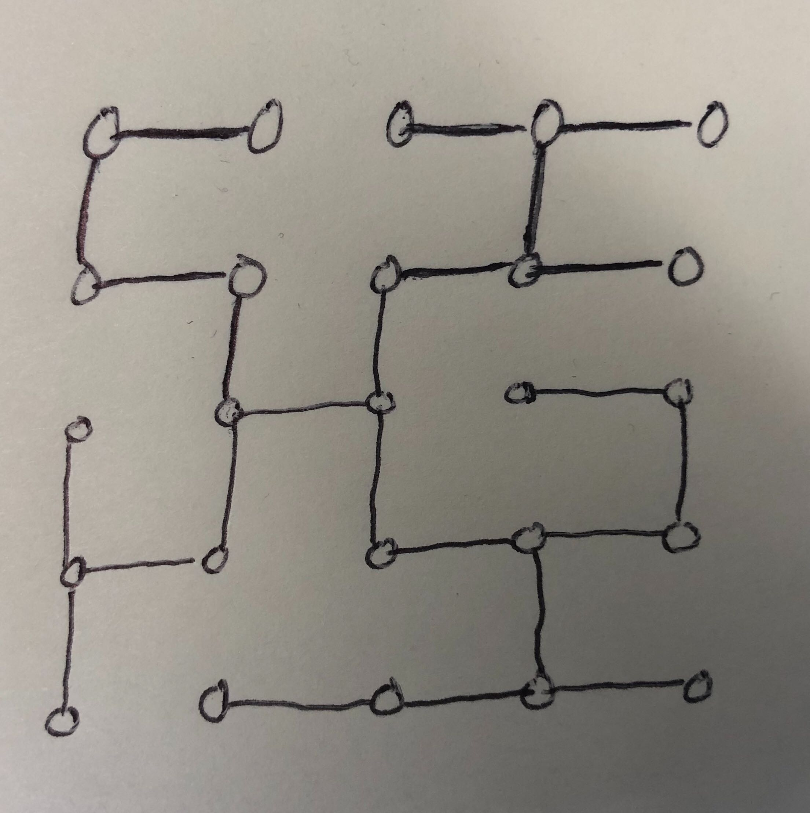
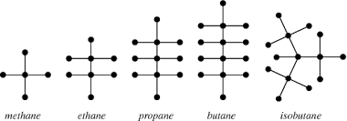
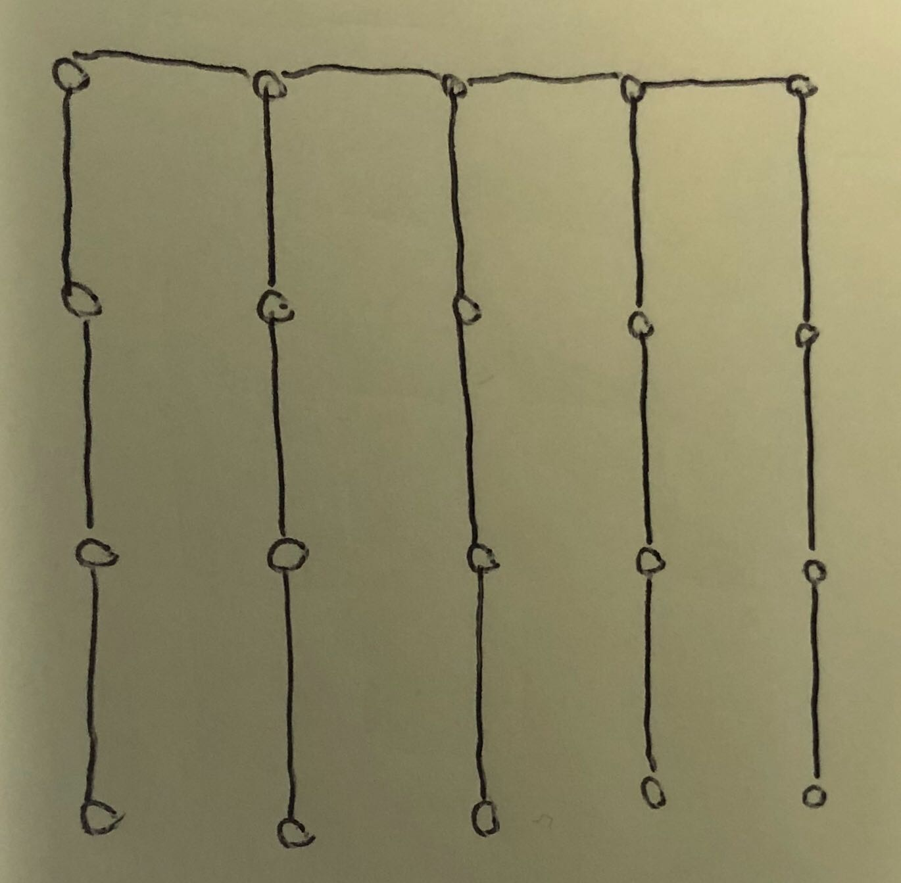
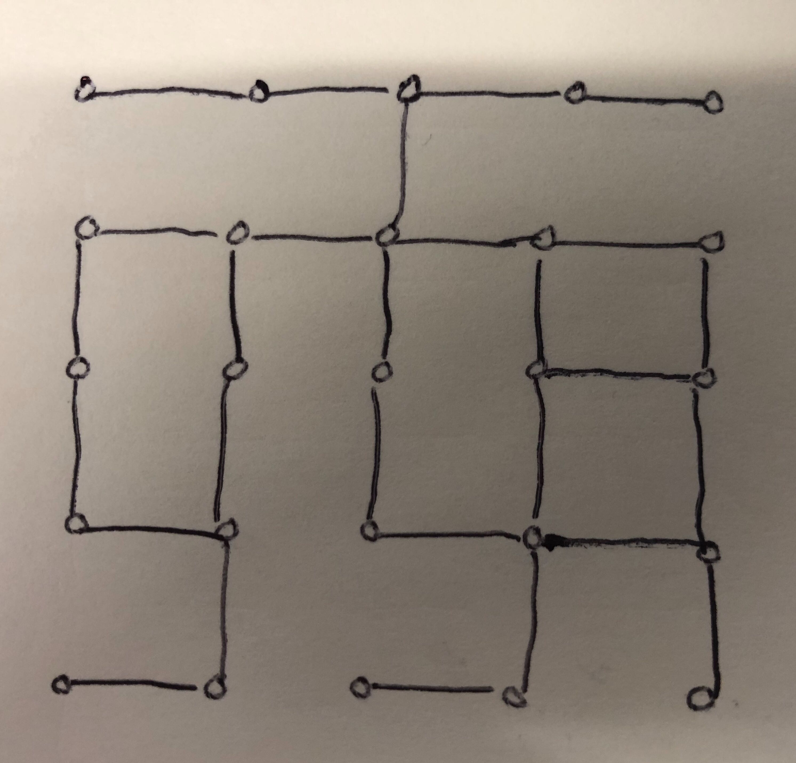
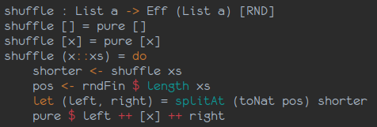

## Mazes hold continuing fascination...

{#id .class width=400 height=400px}\

\newpage

## ... so let's write a program to generate them

- I've been trying to learn Idris, a somewhat bleeding-edge programming language 
which is like Haskell but more so

- I (wrongly) decided I understood it well enough to try writing a program to 
generate mazes

- The hard things turned out to be simple, 
but the simple things were hard...

\newpage

## The mission

How about a maze that looks like this:

 
{#id .class width=300 height=300px}\

Let's output this +in text mode using quarter-square graphics.

Once the basic algorithm is done, it can scale up to do bigger and badder mazes.

\newpage

## How do you generate a maze?

Abstracting away the irrelevant details, the structure of the
maze is: 

{#id .class width=300 height=300px}\
 
It's a rectangular grid of cells with connections added between adjacent cells to form a *tree*.

\newpage

## Trees - a concept from graph theory

{#id .class width=600 height=200px}\

A *tree* is a graph with just enough edges to make it one piece, or, equivalently, 
as many edges as possible without forming a circuit.

Poetically, a graph consisting of a bunch of trees is called a *forest*.

\newpage

## CompSci description of the problem

Given a rectangular grid of cells, make it into a graph by connecting
every pair of adjacent cells with an edge.

We have to find a *spanning forest* of this graph.

This is pretty simple: you just accumulate a list of edges,
only adding ones that don't create a circuit.    

\newpage

## But if you do that... 

{#id .class width=200 height=200px}\

Not an acceptable solution: the same boring maze each time.

We have to introduce randomness, i.e. present the edges in a random order.

Absurdly, this was the hardest part of the project.

\newpage

## Skating lightly over the algorithm

Here it is, anyway: 

{#id .class width=600 height=400px}\

This was hard too, but in a good way. 

\newpage

## Let me unpack that for you

It's basically just a fold - accumulating a list of edges - but
you have to efficiently keep track of which cells are connected.

You also have to use the right data structures in Idris, 
and figure out how to test-drive it...
all of which took a while.

\newpage

## Debugging the mazes

{#id .class width=400 height=300px}\

After staring at this for hours, I realized that the bottom and right edges were
mangled because of a fencepost error (easily fixed)

Also the randomizer wasn't working properly. 
But all it had to do was shuffle the list of edges...?

\newpage

## Why is randomness so hard?

{#id .class width=400 height=300px}\

It isn't functional! A function that returns random numbers isn't allowed in
Idris because it can return a different value on every call, violating the semantics.
Same goes for calculating the date and time.

\newpage

## Into the dark heart of the effects monad

You have to generate random numbers in the context of a special monad, and use the 
Effects library to get it to interoperate with all the other monads you have to use for
anything else that is not strictly functional...Yes, I know this is why not everyone 
would want to use languages like Idris. 

Also, it turned out there was a *bug* in the run time library which was interacting
adversely with the perhaps overcomplicated "Godel numbering scheme for permutations"
I had decided to use, which was fun to implement but not, as it turned out, practical.

\newpage

## The solution...

... was to look up "generating uniformly random permutations" on
Wikipedia which tells you to use the Knuth shuffle.

But even that is hard! The algorithm involves swapping successive pairs of elements in an 
array to generate the permutation by composing transpositions. And that's non-functional - arrays
are not mutable in Idris.  

I managed to write a recursive algorithm to do it by disassembling and recombining the array,
but it was very slow for mazes of any size.

\newpage

## Optimizing the shuffle

I searched the web to find out how Haskellers get round this problem, and it turns out they do it by
using a special hack to mutate the array, because Haskell is a more mature (and possibly more pragmatic) 
language than Idris.

I conjecture that generating random permutations in an efficient yet functionally pure way 
should be achievable, but for now, this seems to be the stuff of CompSci PhD theses. 

\newpage

## An expedient hack

Meanwhile, here is my not-too-chronically-slow compromise solution: 

{#id .class width=700 height=400px}\ 
  
\newpage

## ... which finally makes it possible ...

... to generate mazes in Idris

(switch to command line for demo)

# THANK YOU   

