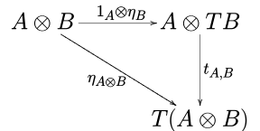

## About me, Felix Dilke

- I'm a software developer on SpringerLink
(link.springer.com)

- Also an amateur mathematician

- Bewl is my 10% time project at Springer Nature

- I wrote it in Java, then Clojure, then Scala

- Bewl is test-driven Scala code, open source on GitHub 

**[https://github.com/fdilke/bewl](https://github.com/fdilke/bewl)**

\newpage

# What is Bewl?

- My math software hobby project since 2008

- Presented in May 2018 at *S-REPLS 9* , an academic seminar about
programming languages at the University of Sussex. 
It got more questions than any other talk!

- Bewl involves ludicrously high-level math, which I'll now try to 
condense into just 3 slides without any equations or diagrams.

- This is a nearly impossible task, so please bear with me.

\newpage

# An arithmetic of set-like objects

Consider the following classes of objects, all of which you
might want to deal with in software:

- graphs (finite networks)

- fuzzy sets (sets with a concept of partial membership)

- permutations (rearrangements of some finite set)

- musical objects (e.g. the twelve-tone octave, or the chord of C major)

The idea of Bewl is to be able to talk richly about
each of these classes (and many more classes yet unexplored) 
**in its own native language**.

What on earth does that mean? We'll get back to musical objects in 
a moment, but first...
\newpage

# Each of these classes forms a **topos**

To remind you, a category is just a bunch of "objects"
(which I prefer to call "dots" because the word "object" is
over-used in computing) and composable "arrows" between them.
They are supposed to represent some sort of family of abstract
entities with some sort of structure, and some sort of appropriately
conditioned mappings between them that preserve the structure.

If that all sounds very amorphous and abstract, that's because it is.

A topos is just an exceptionally nice and well-equipped category,
i.e. one with all the optional extras (+, *, ^, Ω).

It's like four function arithmetic! (+, *, -, /)
Only with set-like objects instead of number-like objects.

A topos is therefore the perfect workspace for all kinds of 
calculations - or it would be if there was software to support it!

So clearly the world needs a four-function calculator for 
topos theory. and that's Bewl. 

The DSL is very expressive and will let you do calculations
with (syntactically meaningful) "elements" of set-like objects,
even though they are not sets and don't have elements.

You can also define algebraic structures like groups and monoids,
and you can do a kind of modified Boolean algebra only with non-Boolean 
truth values... on a good day, it feels like there are worlds here 
waiting to be explored. 

\newpage

# Musical objects

"The Topos of Triads", Thomas Noll, 2005 

(paper on CiteSeer)

Noll explores music theory by defining a "triadic monoid" 
and working in the topos of actions over it. So octaves, chords
and note sequences all become addressable objects in the topos.

(The monoid is a set of affine transformations of the octave that
preserve the chord, so we can immediately regard it as acting on them.)

Noll had to do all these calculations by hand, for example
enumerating topologies on the triadic topos.

Bewl can now do many of these calculations! (It can't enumerate
topologies yet, but this is certainly within reach.)

\newpage

# To make up for all that math...

here are some quick takeaways about category theory (CT), because
many developers seem to be curious about it, especially in 
relation to functional programming (FP).

IMHO:

- programmers don't need to understand it, any more than they
need to understand electrical engineering

- CT is really a junction point between math and
software, which have only developed separately because of a
lack of computing power

- the first notable theorem in CT is Yoneda's Lemma, which
provides a full embedding of any category into a topos (i.e.
extends it to support four-function arithmetic.) One interpretation:
if you're working in a category, you might as well be working in a topos.    

- really CT should just be implicitly baked into the languages 
and tools we use, to make them more expressive and powerful,
but without us having to think about it.
 
Example: Monads! (a.k.a. "programmable semicolons")

\newpage

# Monads and Bewl 

Let's try to clear up some of the confusion...

- When computer scientists talk about monads, they actually mean
what CT would call **strong monads**.

(This took me **months** to figure out)

- You can look up "strong monad" on Wikipedia

- It's a misnomer to even ask if a monad is strong! You should really be asking
whether it can uniquely be the monad part of a naturally occurring strong monad.

- Wikipedia will show you 4 scary diagrams which describe the requirements
for a monad to be strong. This means it comes with an additional operation
called **tensorial strength** which has to have certain properties.

Luckily...

\newpage

# All these diagrams can be snappily expressed in Bewl's DSL



```scala
    def sanityTest4[
      A <: ~,
      B <: ~
    ](
      a: DOT[A],
      b: DOT[B]
    ) =
      tensorialStrength(a, b) o (
        (a *- b) x (
          eta(b) o (a -* b)
        )
      ) shouldBe
        eta(a x b)
```

and there are unit tests to verify the requirements for strong monads.

\newpage

# I'm sorry if this brutally truncated summary was already too much 

There are lots more presentations diving into the detail on Bewl's GitHub page.

The dream of being able to do unspecified-but-amazing things with graphs, fuzzy sets and
musical objects has yet to be fully realized because:

- there are performance issues (especially for musical objects)

- huge blocks of textbook math have now been translated into Bewl classes and
modules... but there is so much more to do! 

- I need to add more topos implementations

But let's talk about how I have written and rewritten all this in different programming languages.

\newpage

(talk about Java, Clojure, Scala and other languages...)

\newpage
