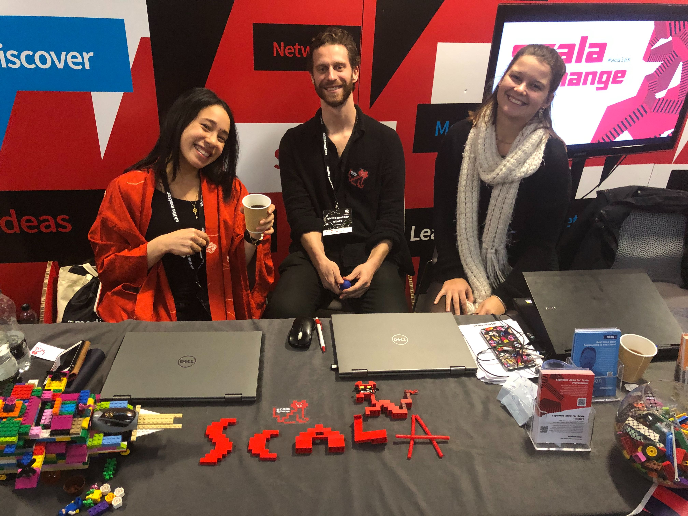
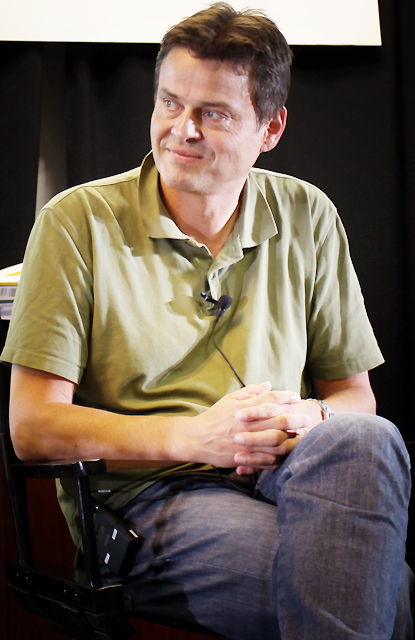
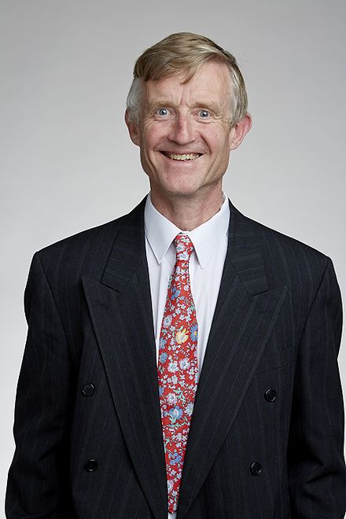
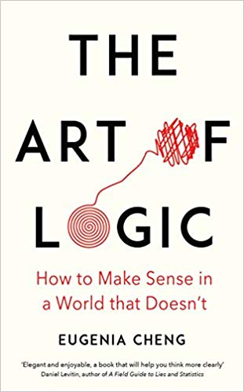
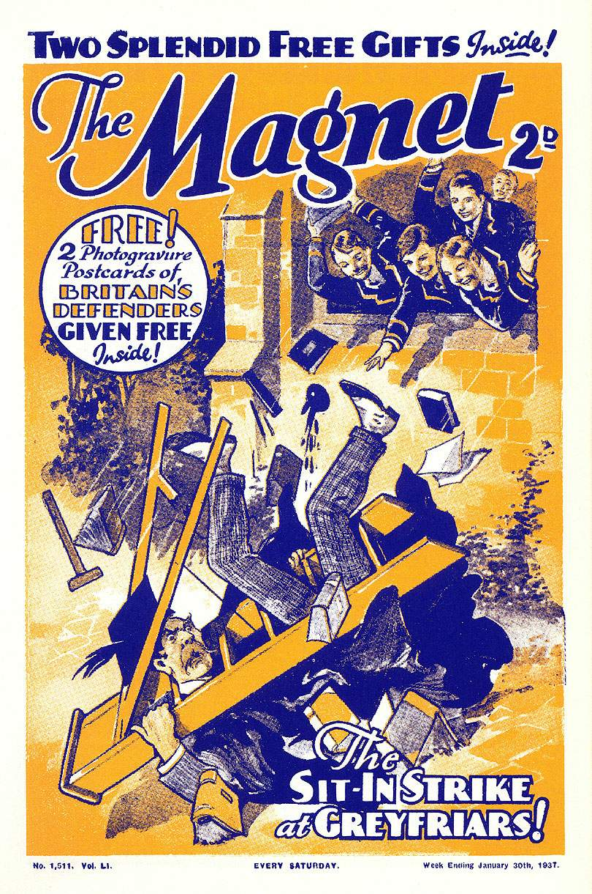
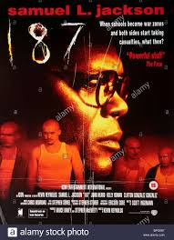
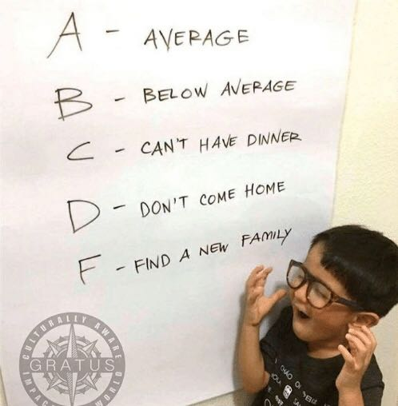

\newpage

\

# Scala Exchange 2018

- In 2018, I was lucky enough to go to 3 conferences!!
Such is the munificence of Springer Nature

- Time to share back

- There were more than a few interesting talks, so I picked the
5-6 most notable, did a thumbnail sketch of those, and crammed
it all into 22 slides.

- I'll skate lightly over the technical talks, and dwell more
on the high-level and touchy-feely ones.

- If any of these spark your imagination, or if you 
want to dive into the detail, the full videos of them are all 
online and easily found.

\newpage

# The torch of Scala is still burning bright 

\

and speaking of combustion, there was a
"fireside chat" between Martin Odersky and Simon Peyton-Jones.
Without an actual fire obviously.

As they are the respective frontmen for Scala and Haskell,
expectations were high, and were not disappointed. 

\newpage

Martin Odersky (principal author of Scala)

{#id .class width=1000 height=400px}\\

\newpage

Simon Peyton-Jones (a lead developer of the Glasgow
Haskell Compiler)

{#id .class width=800 height=350px}\

\newpage

# When champions meet 

- SPJ: FP is on a long slow burn, fundamentally reshaping software 
development. It's a grand experiment. When the limestone of imperative 
programming has worn away, the granite of FP will be revealed! 
You are the granite.

- MO: The strongest influence on Scala initially was Ocaml

- SPJ: C.A.R. Hoare: “Haskell is doomed to succeed”. 
Compile everything into a small statically typed core. 
There are 8 fundamental constructors for types. 
Everything else on top of this is just syntactic sugar.

- MO: On language size: Scala is unfairly regarded as large. 
In fact Haskell is slightly smaller than Scala 
but only if you neglect the language extensions! 
C# and F# are much bigger. 

- SPJ: Haskell now has SO MANY language extensions that a 
lot of programs start with a whole page of them. 
Is the language menaced by heat death due to complexity? 
Somebody will come up with a clean implementation. 
Mostly, the cost of complexity is superficial - 
The main problem is just coping with the sheer volume of
new features that people want to cram in, most of
which can be cleanly accomodated with the existing 
architecture.

\newpage

# More words of wisdom from these giants of FP

- SPJ: I didn’t think Rust could ever have a proper, sound foundation -
 but now it does! 

- MO: want to add algebraic effects - like monads, 
but they commute!

- SPJ: don’t quite know how to finesse the choice between being 
strict and lazy - make the language agnostic.

- MO: Macros are still very experimental. 
The community took control. Trying to sort it out with Scala 3. 
The compiler team is dragged behind - catching up with what the 
community wants.
 
- SPJ: GitHub are using Haskell for verification. 
They can’t wait for the next version with its quantified constraints.
Industry is actually more demanding of new features than universities. 

- MO: I envy Haskell its significant white space. 

- SPJ: Happy for Idris to crush Haskell! 
But first it would have to improve and generate lots more tooling. 
Meantime it’s a wonderful source of ideas. 
 
\newpage

# Meetings With Remarkable Trees by Bodil Stokke

- Part of the secret sauce of Clojure is PersistentVector,
a novel and ingenious data structure for efficient hashmaps

- Based on Bagwell's theory of the relaxed radix, a mechanism
for fast indexing

- The relaxed radix balanced tree (RRB tree)

- Can be derived by starting with a really simple (if quirky)
algorithm based on arrays of 4 cells

- You list the performance characteristics of basic tree
operations, then repeatedly tweak until everything is O(log n) 

For the gory details, watch the video

\newpage

# Cobind and Chill by Danielle Ashley

- This talk was about comonads, the lesser-known evil twin of
monads. They are just the dual construction of monads, derived
by flipping all the arrows!

- So it's the same theory, but has rather different interpretations
and applications in the (pseudo-)categories we work with.

- One such application is digital signal processing (DSP).

- The speaker demonstrated a bunch of comonadic code which applied
everyday signal processing operations (like Fourier transforms and
convolution) in a typesafe way to decode analog signals from
1970s-era TV broadcasts.

- The punchline: decode the much-loved BBC test card complete
with faithfully reproduced analog glitches with bleeding colours
and spurious dots. So you know it's the real deal.

\ 

\newpage

# Heady nostalgia for the lost world of analog A/V technology

- One detail was that you can't use Arduino hardware for this, because
the transmitting frequency is too high (16 MHz).

- Also the way that colour information was retrofitted onto the B&W signal is
analogous to the retrofitting of stereo onto the monaural sound encoding
used in Thomas Edison's original gramophone players.

\ 

\newpage

# Keynote: Conveying the Power of Abstraction by Eugenia Cheng

\ 

Eugenia Cheng is a mathematician and concert pianist who has
become the unlikely media-friendly face of category theory.

It all started with the charmingly abstract Catsters videos
(each 10 minutes long) which you can see on YouTube. 

She also spoke at Lambda World, so is now active on the tech
conference speaker circuit as well.

\newpage

They were giving away copies of her new book:

{#id .class width=1500 height=600px}\

It has a whole chapter just about analogies.

I regifted mine to my 10yo niece, who wants to be a famous woman
scientist when she grows up. 

\newpage

# Eugenia Cheng pursues a worthy goal

- Motivation: find out why people get turned off maths, fix it!

- Teaches maths/abstraction to art students at a liberal arts
college in Chicago. The art students find it useful for
"thinking about stuff".

- She used to think of research on category theory as eventually 
trickling down to the real world. Now sees it as:
A tool for helping us to think. 

- Paraphrasing, maths is a tool for people who want to communicate
ideas precisely and unambiguously.

- (Understatement) There are a lot of people very much not doing this in 
our world today.

- Gives examples of concepts from identity and gender politics where
you can at least try to lower the temperature by clarifying the
concepts under discussion.

Reminded me that this is why I like maths - it's civilized, and
it takes for granted that everybody's decent and we're all
searching for the truth together.

The next talk is more of a call to arms:

\newpage

# How to fix the UK software education crisis

\

# How lucky we all are here to be skilled, highly compensated professionals with good life choices

- Let’s spread the joy 

- Motivating you to volunteer in schools to help pupils 
interested in learning about technology. 

- Initiative by Morgan Stanley: perhaps not the first name you'd
think of in charitable initiatives, but they are really serious
about this and support it at management level. It's even taken
into account during annual performance reviews

- You have the skills to make up for the lack of teachers who
can effectively teach this curriculum.

\newpage

# What is volunteer teaching actually like?

{#id .class width=1200 height=500px}\

\newpage

# Schools vary of course

{#id .class width=1200 height=500px}\

\newpage

# You want to be the willing helping the keen 
 
- There are not that many schools in London.
 
- So actually, we have the numbers to make a major difference 
to pupil/teacher ratios. 
 
- The model of helping directly in the classroom has been really powerful. 
Shows the pupils that “technology professionals” are normal people just like them. 

- Surprising thing: how much the volunteers got out of it. 
Access to senior teachers in the schools. 

- Fun of breezing through GCSE problems. 

- See the light bulb go on - changing people’s lives. 

- Also there are gifted pupils who’ve outgrown the school. 

\

\newpage

Where there's something indefensible, there is a career to
be made for somebody defending it. This is why Nick Clegg now
works at Facebook. 

By the same token, here is a talk about your favourite build tool:

# Principled SBT by Andrea Peruffo

People complain about SBT, 
but it’s a powerful tool which would be hard to replace.
Also it is interactive: there's a shell.

One problem is that typically you can't get useful
guidance from Google, or even Stack Overflow.

Anyway, the core concepts are simple:

# Settings - the variables of your build

# Tasks - utility methods

# Configurations - a place to put config info

# Projects - folders for organizational units

# Scopes - tie together 3 axes of project / config / task. 

The talk made me realize that when moaning about SBT, I would
have more of a leg to stand on if I had ever spent half an hour
reading its documentation... which MUST have got better since
the last time I looked at it.

Soon to support LSP (Language Server Protocol). 

\newpage

\

Another talk that seemed to strike a chord with the audience:

# Keynote: Occupational Burnout by Jessica Rose
  
- Burned out? You can’t build beautiful useful things. 

- As a teacher she became weirdly obsessed with the human brain. 
A wet bobble of meat drenched in chemicals.
 
- Cognitive Psychology: gives us the vocabulary to talk about
the brain hitting its capacity
 
- concepts of working memory, cognitive load
  
- typical failure mode: overload due to multitasking 

- If you consistently overload your working memory, you will become burned out

- Occupational burnout has symptoms of mental and physical exhaustion: 
everything has been too much for a long time. 

- Long term unavoidable stress. Mirrors, and may trigger, depression 

\newpage
  
# Look around you and see the signs

\

- Are you cynical or critical at work?
 
- Do you have to drag yourself there?

- Are you irritable or impatient with people?

- Do you lack the energy to be consistently productive?

- Do you lack satisfaction from your accomplishment? Not feeling the wins?

- Do you numb yourself with food/drink?

\newpage
  
# Recovering from burnout takes a long time
 
- If possible take 6 months off with your horses. 
Say you’re writing a book! No one ever asks to see it.
 
- Do less, in ways that won’t damage your life. 
Outsource. Rely on friends and family. 
Start saying no (Do you want to practice?)

- Put on your own air mask before helping other people.
 
- Selective emotional investment.
 
- There are only so many things you can spend your time on.
 
- Protect your time. 

- Concentrate on things that are meaningful

- Ask for help. (If nothing else it stops people asking you)

- Recharge. Spend time reading, or board games - do things 
  that make your life better and are not energy sinks. Reduce stressors. 

- Sometimes the logical conclusion to this is: quit your job. 
  
- An audience member: why is burnout a recurring theme at conferences?
  Because in general, the industry has been hooked on cyclically 
  destroying people for decades - and it's not sustainable. 
  
For me, this was a timely reminder of previous places I've worked -
investment banks, especially -
and of the much better work-life balance we have at Springer Nature!
  
# THANK YOU